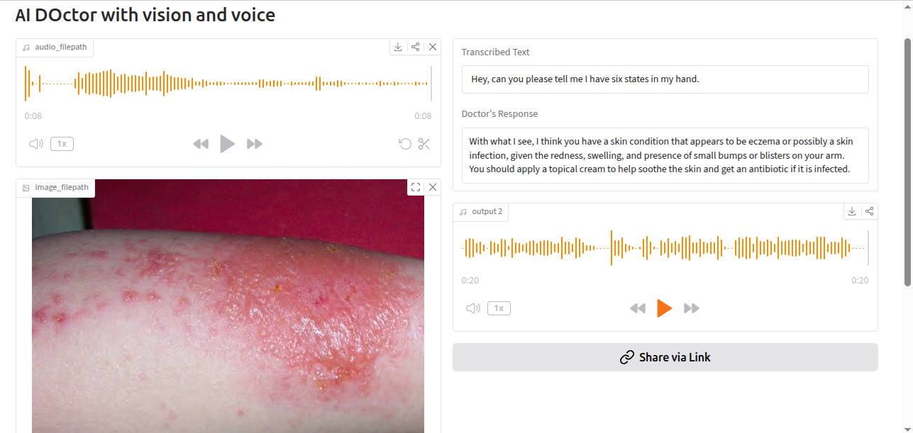

# AI Doctor

An AI-powered multimodal medical assistant that combines:

- Speech-to-Text using Groq Whisper
- Medical Image Analysis using Llama Vision
- Text-to-Speech using ElevenLabs / gTTS
- Gradio Interface

